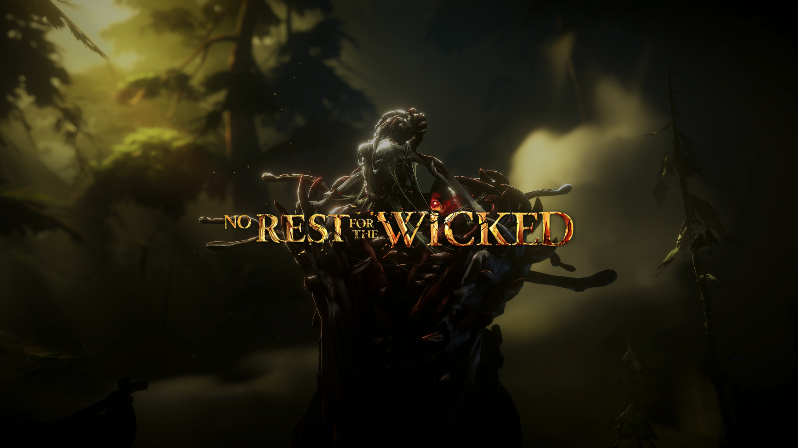

# No Rest for the Wicked — Omarchy Theme

An immersive dark-fantasy theme for [Omarchy](https://omarchy.org), inspired by Moon Studios' *No Rest for the Wicked* (恶意不息).

Captures the painterly, Renaissance-inspired oil artwork of Isola Sacra: deep abyssal sea rock, weathered parchment, sacred inquisitor gold, and pestilent blood red.



## Install

```bash
omarchy theme install https://github.com/hongyangchun/omarchy-no-rest-for-the-wicked-theme.git
```

Or from the desktop: `Super + Alt + Space` → **Install** → **Style** → **Theme**, then paste the repository URL above.

To activate:
```bash
omarchy theme set "No Rest for the Wicked"
```

## Palette

| Role | Hex | Description |
|---|---|---|
| `background` | `#0e1117` | Abyssal storm sea rock |
| `dark_background` | `#090c10` | Deep sea shadow |
| `lighter_background` | `#181d26` | Wet gothic stone surface |
| `foreground` | `#d2cbbe` | Ancient parchment |
| `bright_foreground` | `#f5efe3` | Holy bone light |
| `accent` | `#c9933b` | Seline's sacred inquisitor gold |
| `selection` | `#242d38` | Murky ocean tide |
| `muted` | `#5d6778` | Weathered stone grey |
| `red` | `#b8353d` | Pestilence blood |
| `green` | `#4a8a72` | Moss & marsh green |
| `yellow` | `#c9933b` | Sacred fire ember |
| `orange` | `#cb6935` | Campfire glow |
| `blue` | `#4a6c8a` | Cerim steel blade |
| `cyan` | `#3b8e8f` | Eerie phosphorescence |
| `magenta` | `#8e5d84` | Dark corruption hue |

### Hyprland Dual-Tone Gradient Borders
* **Active Border**: `rgba(c9933bee) rgba(b8353dee) 45deg` (Transitioning from sacred gold to plague red at 45°)
* **Inactive Border**: `rgba(181d26aa)` (Subtle cold slate stone)

All application configs (Alacritty, Ghostty, Kitty, Foot, Neovim, Btop, Shell/Waybar, Obsidian, VSCode, Hyprlock) are automatically generated by Omarchy from `colors.toml`.

## Wallpapers

Includes 14 curated official 4K/2K artworks from Moon Studios:
- `01-the-breach.jpg` — The Breach entrance and crashing waves (4K)
- `02-sacrament-ruins.jpg` — Ancient clocktower and gothic ruins (4K)
- `03-dark-coast.jpg` — Stormy night reefs and lonely ship (4K)
- `04-sacra-overlook.jpg` — Dusk vista overlooking Isola Sacra (4K)
- `05-pestilent-depths.jpg` — Pestilence tear and mysterious fissure (4K)
- `06-dungeon-depths.jpg` — Subterranean dungeon caverns (4K)
- `07-sacrament-square.jpg` — Timber town market square (4K)
- `08-shipwreck-shores.jpg` — Dark coastal shipwrecks (4K)
- `09-ancient-forest.jpg` — Sunlit ancient forest canopy (4K)
- `10-pestilent-bog.jpg` — Toxic swamp and fungal gloom (4K)
- `11-mountain-pass.jpg` — Precarious high-altitude mountain bridge (4K)
- `12-cathedral-sanctuary.jpg` — Grand cathedral holy light (4K)
- `13-fortress-courtyard.jpg` — Battle-worn ancient fortress plaza (4K)
- `14-isola-sacra-keyart.jpg` — Official panoramic key artwork (2.5K)

Cycle backgrounds with `omarchy theme bg next` or open the graphical selector with `omarchy theme bg-switcher`.

## Icons

Configured for `Yaru-red-dark`.

## Reverting

Switch back to any theme at any time without leaving unwanted configuration residues:
```bash
omarchy theme set "Roman Republic"
```

## License

MIT — see [LICENSE](LICENSE). Artwork and logos © Moon Studios & Private Division.

---

> This theme was made with the [omarchy-theme-skill](https://github.com/hongyangchun/omarchy-theme-skill) - the pipeline that sources art, builds palettes and ships the repo.
